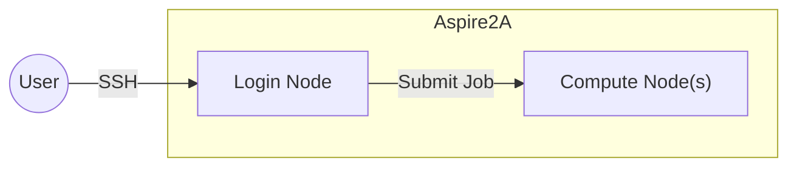

# HPC/AI Workshop 1: Introduction to HPC Performance Optimisation with Aspire2A

High Performance Computing (HPC) is about more than having access to thousands of CPU cores 
it is about writing software that can efficiently utilise those resources.

In this workshop, we will build and optimise the **LULESH (Livermore Unstructured Lagrangian Explicit Shock Hydrodynamics)** application developed by Lawrence Livermore National Laboratory (LLNL) to simulate Hydrodynamics, how fluids move and interact with each other.


By the end of this workshop you will have learned:
- Using the Aspire2A supercomputer.
- building scientific applications
- compiler optimisation
- performance profiling
- OpenMP parallelisation
- MPI execution
- performance analysis.

## Optimisation Flow
Instead of applying all optimsations all at once, we apply optimisations iteratively to observe their effect.

> **Measure → Identify Bottlenecks → Optimise → Measure Again**

Each optimisation will be compared against a **recorded baseline** so that performance improvements can be quantified.


---

# Workshop Flow

| Stage | Goal                                    |
| ----- | --------------------------------------- |
| 1     | Build a working program                 |
| 2     | Measure baseline performance            |
| 3     | Profile the application                 |
| 4     | Optimise: Enable compiler optimisations |
| 5     | Optimize: Enable OpenMP                 |
| 6     | Optimise: Run with MPI                  |
| 7     | Independent optimisation exercises      |

---


# Setup: Access Aspire2A

Follow the steps [here](https://github.com/ntuhpc/workshops/blob/80a281c2f74330305a1bb65f35b30b76e6ee5eaa/ml_aspire2a/README.md#access-aspire2a) to access aspire 2A.
# Part 1 - Build LULESH

Clone the repository

```bash
git clone https://github.com/LLNL/LULESH.git
cd LULESH
```


## Software Modules

Aspire2A uses an **environment module system** to manage compilers, MPI libraries, and scientific software. Before building an application, load the required software stack.

Common commands:

```bash
module purge          # Start with a clean environment
module avail          # List available modules
module list           # Show loaded modules
module load <module>  # Load a module
module unload <module>
```

Throughout this workshop, you will use modules to switch between different compiler and MPI environments. Start by using the GNU programming environment's modules:
```shell
module purge
module load PrgEnv-gnu
module list # list what modules are included
```

```
Currently Loaded Modulefiles:
  1) gcc/11.2.0               3) cray-dsmml/0.2.2         5) craype-network-ofi       7) cray-libsci/21.08.1.2    9) PrgEnv-gnu/8.3.3
  2) craype/2.7.15            4) libfabric/1.11.0.4.125   6) cray-mpich/8.1.15        8) cray-pals/1.1.6
```

## Make

**Make** is a build automation tool that compiles source code according to rules defined in a **Makefile**. 
It determines which files need to be rebuilt based on their dependencies and invokes the appropriate compiler commands automatically.

Take a peek at the Makefile to understand how LULESH is built:
```bash
less Makefile
```

Try to build LULESH using the provided Makefile.

```bash
make clean
make
```

```
Building lulesh.cc
mpig++ -DUSE_MPI=1 -c -g -O3 -fopenmp -I. -Wall -o lulesh.o  lulesh.cc
make: mpig++: Command not found
make: *** [Makefile:47: lulesh.o] Error 127
```
Bummer, the Makefile is trying to use `mpig++`. which is not available in the GNU programming environment.

We have two choices:
1. Load a prebuilt MPI implementation via `module load`.
2. Build a MPI implementation ourselfes

> In the interests of time, we will use a prebuilt implementation and building an MPI implementation by yourself is left as an exercise for the reader.

Discover what MPI implementations are available with `module avail`:
- `2>&1` redirects standard error to standard output, so that both are captured by the `grep` command.
```bash
module avail  2>&1 | grep mpi
```

```
cray-mpich/8.1.15(default)
cray-mpich-abi/8.1.15(default)
cray-mpich-abi-pre-intel-5.0/8.1.15(default)
cray-mpich-ucx/8.1.15(default)
bedtools/2.30.0                     namd/2.14_mpi_icc
berkeleygw/4.0-intel-mkl-cmpi       ncl/6.6.2
cuda/12.2.1                         nvhpc-byo-compiler/22.3
cuda/12.2.2                         nvhpc-nompi/22.3
gcc/10.3.0-nscc                     openfoam/2406-ompi505
gcc/11.4.0-nscc                     openmpi/4.1.2-hpe(default)
gcc/12.1.0-nscc                     openmpi/4.1.5-gcc11
gcc/12.2.0-nscc                     openmpi/4.1.6-gcc11
gcc/12.3.0-nscc                     openmpi/4.1.7-gcc11
gcc/14.2-nscc                       openmpi/4.1.7-icc24.2.1
gcc/15.2.0-nscc                     openmpi/5.0.5-gcc11
ghostscript/9.25                    openmpi/5.0.5-icc24.2.1
git/2.39.2                          openmpi/5.0.5-nv22.11
go/1.18.1                           openmpi/5.0.8-gcc11
go/1.21.1                           openmpi/5.0.8-gcc11-cu12
go/1.23.4                           openmpi/5.0.10-gcc11
go/1.24.4                           openmpi/5.0.10-gcc11-cu12
gromacs/2026.1-gnu-ompi             pytorch/1.11.0-py3-gpu
faocl/3.1.0-aocc3.2                  hdf5/1.12.1-parallel-icc22-ompi4
aocl/3.1.0-gcc11.1                  hdf5/1.12.1-parallel-icc23-cmpi
aocl/3.2.0-aocc3.2                  hdf5/1.12.1-parallel-icc24-ompi4
aocl/3.2.0-gcc11.2                  hdf5/1.12.2-parallel-icc22-cmpi
aocl/4.0.0-aocc4.0                  hdf5/2.0.0-parallel-gcc-cmpi
aocl/4.0.0-gcc11.2                  hdf5/2.0.0-parallel-icc24-ompi
fftw/3.3.10-gcc11-ompi4             openblas/0.3.23
fftw/3.3.10-icc22-cmpi              openjpeg/1.5.2
fftw/3.3.10-icc22-ompi4             openjpeg/2.4.0
gmp/6.2.1                           scalapack/2.2.0-icc22-cmpi-openblas
grib_api/1.25.0                     scalapack/2.2.0-icc22-ompi4-mkl22
gsl/2.7.1-gcc11                     scalapack/2.2.0-icc23-cmpi-mkl23
gsl/2.7.1-hpe                       scalapack/2.2.0-icc24-cmpi
hdf5/1.8.23-parallel-icc22-vmpi2    sparsehash/2.0.4-gcc11
hdf5/1.10.8-parallel-icc22-cmpi     szip/2.1.1
hdf5/1.12.1-parallel-icc22-cmpi
```

There are many `mpi` choices available. Lets try `openmpi/5.0.10-gcc11` and rebuild:

```bash
module load openmpi/5.0.10-gcc11
make
```

```
Building lulesh.cc
mpig++ -DUSE_MPI=1 -c -g -O3 -fopenmp -I. -Wall -o lulesh.o  lulesh.cc
make: mpig++: Command not found
make: *** [Makefile:47: lulesh.o] Error 127
```

Hmm no luck, lets take a look at the first few lines of the `Makefile` for clues
```make
#default build suggestion of MPI + OPENMP with gcc on Livermore machines you might have to change the compiler name

SHELL = /bin/sh
.SUFFIXES: .cc .o

LULESH_EXEC = lulesh2.0

MPI_INC = /opt/local/include/openmpi
MPI_LIB = /opt/local/lib

SERCXX = g++ -DUSE_MPI=0
MPICXX = mpig++ -DUSE_MPI=1
CXX = $(MPICXX)
```

We see that `SERCXX`, `MPICXX` are set to compiler commands `g++` and `mpig++`, lets check if we have them on our system:
```bash
g++
```

```
g++: fatal error: no input files
compilation terminated.
```


```bash
mpig++
```
```
bash: mpig++: command not found...
```

Weird, we have loaded `openmpi/5.0.10-gcc11`  but is missing the compiler. Attempt to find the compiler using the shell's autocomplete:
```bash
mpi<Tab><Tab>
```
```
mpic++        mpicc         mpiCC         mpicxx        mpiexec       mpiexec.pals  mpif77        mpif90        mpifort       mpirun
```

Ah! The compiler is named differently, we correct this by applying a command line override to `MPICXX` when building with make. 
```bash
make MPICXX="mpicxx -D USE_MPI=0 -D WITH_OPENMP=0" CXXFLAGS="-g -I." LDFLAGS="-g"
```

> Quotes `"` are necessary to ensure the entire quoted value is passed into `MPICXX` . For teaching purposes, we build without MPI & OpenMP and disable compiler optimisations.

```
Building lulesh.cc
mpicxx -D USE_MPI=0 -D WITH_OPENMP=0 -c -g -I. -o lulesh.o  lulesh.cc
Building lulesh-comm.cc
mpicxx -D USE_MPI=0 -D WITH_OPENMP=0 -c -g -I. -o lulesh-comm.o  lulesh-comm.cc
Building lulesh-viz.cc
mpicxx -D USE_MPI=0 -D WITH_OPENMP=0 -c -g -I. -o lulesh-viz.o  lulesh-viz.cc
Building lulesh-util.cc
mpicxx -D USE_MPI=0 -D WITH_OPENMP=0 -c -g -I. -o lulesh-util.o  lulesh-util.cc
Building lulesh-init.cc
mpicxx -D USE_MPI=0 -D WITH_OPENMP=0 -c -g -I. -o lulesh-init.o  lulesh-init.cc
Linking
mpicxx -D USE_MPI=0 -D WITH_OPENMP=0 lulesh.o lulesh-comm.o lulesh-viz.o lulesh-util.o lulesh-init.o -g -lm -o lulesh2.0
```

Finally, LULESH has been built.
# Part 2 - Measure Baseline

## Aspire2A 


When you connect to Aspire2A via SSH, you are connected to a **login node**. Login nodes are intended for lightweight tasks such as editing files, compiling code, and submitting jobs.

To use Aspire2A's compute resources (CPUs and GPUs), you must request a **compute node** through the PBS scheduler. While small builds can be performed on the login node, computationally intensive builds and all applications runs should be performed on a compute node.
### PBS Scheduler

Request an interactive compute node with:

```sh
qsub -I -q normal -P personal -l select=1:ncpus=1 -l walltime=1:00:00
```

- `qsub` - Submit a job to PBS.
- `-I` - Start an interactive shell on the allocated compute node.
- `-q normal` - Submit to the `normal` queue.
- `-P personal` - Charge the job to your personal project.
- `-l select=1:ncpus=1` - Request one CPU core on one compute node.
- `-l walltime=1:00:00` - Reserve the node for up to one hour.

> Once the job starts, your terminal is running on the allocated compute node and any commands you execute will use its resources.

## Run Lulesh

Before attempting any optimisation, establish a unoptimised baseline to compare against. We measure the runtime of LULESH on problem size `-s` of 25.

```bash
cd $PBS_O_WORKDIR # change to the folder you ran qsub from.
module load 
./lulesh2.0 -s 25 -p
```

```
Running problem size 25^3 per domain until completion
Num processors: 1
Total number of elements: 15625

To run other sizes, use -s <integer>.
To run a fixed number of iterations, use -i <integer>.
To run a more or less balanced region set, use -b <integer>.
To change the relative costs of regions, use -c <integer>.
To print out progress, use -p
To write an output file for VisIt, use -v
See help (-h) for more options

Run completed:
   Problem size        =  25
   MPI tasks           =  1
   Iteration count     =  752
   Final Origin Energy =  1.454737e+05
   Testing Plane 0 of Energy Array on rank 0:
        MaxAbsDiff   = 3.637979e-11
        TotalAbsDiff = 4.633302e-10
        MaxRelDiff   = 5.848682e-13

Elapsed time         =         65 (s)
Grind time (us/z/c)  =  5.5653944 (per dom)  ( 65.393384 overall)
FOM                  =  179.68179 (z/s)
```

Record the `Elapsed Time` as your baseline

---

# Part 3 - Verify Correctness

Performance means nothing if the program produces incorrect results.

Verify

- completes successfully
    
- final energy is correct
    
- no runtime error
    

Discuss

> Optimisation should never change scientific correctness.

---

# Part 4 - Profile Before Optimising

Now ask the question:

> Where is the program spending its time?

Use Linux timing.

```bash
time ./lulesh2.0
```

Then use a profiler.

For example

```bash
gprof
```

or

```bash
perf
```

or Intel VTune (if available).

Questions

- Which functions dominate runtime?
    
- Is the program compute bound?
    
- Is it memory bound?
    

Students should identify the top 5 functions.

---

# Part 5 - Compiler Optimisation

Without changing a single line of code, try different optimisation levels.

Compile

```bash
-O0
```

```bash
-O1
```

```bash
-O2
```

```bash
-O3
```

Optionally

```bash
-Ofast
```

Record

|Flags|Runtime|Speedup|
|---|---|---|
|-O0||1.00×|
|-O1|||
|-O2|||
|-O3|||
|-Ofast|||

Discussion

- Why does optimisation improve performance?
    
- Why isn't the improvement infinite?
    
- Is `-Ofast` always safe?
    

---

# Part 6 - Different Compilers

Now repeat exactly the same benchmark using another compiler.

Example

- GCC
    
- Intel OneAPI
    
- Clang (if available)
    

Record

|Compiler|Runtime|
|---|---|
|GCC||
|Intel||
|Clang||

Discussion

Why can different compilers produce different executables from identical source code?

---

# Part 7 - OpenMP

Now introduce shared-memory parallelism.

Compile

```bash
make USE_OPENMP=1
```

Run

```bash
OMP_NUM_THREADS=1
```

Then

```bash
OMP_NUM_THREADS=2
```

```bash
OMP_NUM_THREADS=4
```

```bash
OMP_NUM_THREADS=8
```

Record

|Threads|Runtime|Speedup|Efficiency|
|---|---|---|---|
|1||1×|100%|
|2||||
|4||||
|8||||

Discussion

- Does performance scale linearly?
    
- Why does efficiency decrease?
    
- What limits OpenMP scaling?
    

---

# Part 8 - MPI

Now move from shared memory to distributed memory.

Compile

```bash
make USE_MPI=1
```

Run

```bash
mpirun -np 1 ./lulesh2.0
```

Then

```bash
mpirun -np 2 ./lulesh2.0
```

```bash
mpirun -np 4 ./lulesh2.0
```

Record

|MPI Ranks|Runtime|
|---|---|
|1||
|2||
|4||

Discussion

- What communication is happening?
    
- Why doesn't doubling the number of processes halve the runtime?
    

---

# Part 9 - Hybrid Parallelism

Finally combine MPI and OpenMP.

Example

```bash
OMP_NUM_THREADS=4

mpirun -np 2 ./lulesh2.0
```

Experiment

|MPI|Threads|Total Cores|Runtime|
|---|---|---|---|
|1|8|8||
|2|4|8||
|4|2|8||
|8|1|8||

Discussion

Which configuration is fastest?

Why?

---

# Part 10 - Submit Through PBS

After experimenting on an interactive node, submit the benchmark as a PBS batch job.

Students modify

- walltime
    
- CPU count
    
- job name
    

Submit

```bash
qsub run.sh
```

Monitor

```bash
qstat
```

Read results

```bash
cat lulesh.o*
```

---

# Challenge Exercises (Student-led)

Rather than giving all optimisations, leave these as investigations.


## Build LULESH with CMake

Compile LULESH **without any compiler optimisations** (`Debug` build).

```bash
mkdir -p build
cd build
cmake -DCMAKE_BUILD_TYPE=Debug ..
cmake --build .
```

Run the executable:

```bash
./lulesh2.0
```

Record the runtime.

| Configuration        | Runtime |
| -------------------- | ------- |
| Serial (Debug / -O0) |         |

This runtime serves as the baseline for later performance comparisons.

---

## Challenge 1

Can you find compiler flags that outperform `-O3`?

Hints

- architecture-specific optimisation
    
- vectorisation
    
- floating-point optimisation
    

---

## Challenge 2

Investigate OpenMP scheduling.

Try

```text
schedule(static)
schedule(dynamic)
schedule(guided)
```

Does runtime change?

---

## Challenge 3

Experiment with

```text
OMP_PROC_BIND

OMP_PLACES
```

Does thread affinity matter?

---

## Challenge 4

Run larger problem sizes.

Does parallel efficiency improve?

Why?

---

## Challenge 5

Profile the OpenMP version.

Has the hotspot changed?

---

## Challenge 6

Compare

- many MPI processes
    
- few MPI processes + many threads
    

Which performs better on Aspire2A?

---

# Final Performance Summary

Students should complete a results table throughout the workshop.

|Stage|Runtime|Speedup|
|---|---|---|
|Serial (-O0)||1×|
|Serial (-O3)|||
|Intel Compiler|||
|OpenMP (8 threads)|||
|MPI (8 ranks)|||
|Hybrid (2×4)|||

This structure keeps the workshop highly interactive. Every section starts with a working program, introduces exactly one new optimization, has students benchmark and record the results, and ends with a discussion about _why_ the observed performance changed. The final challenge exercises deliberately leave several important optimization techniques unexplored so students can investigate them independently or in a follow-up workshop.
