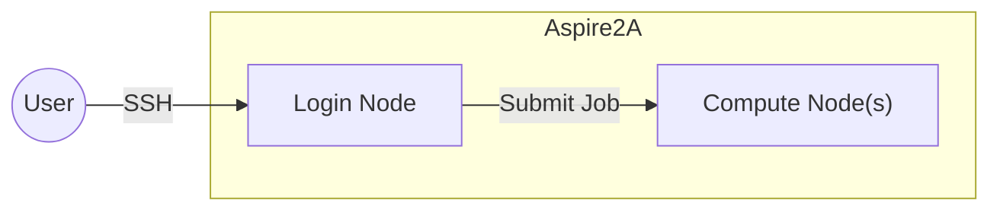
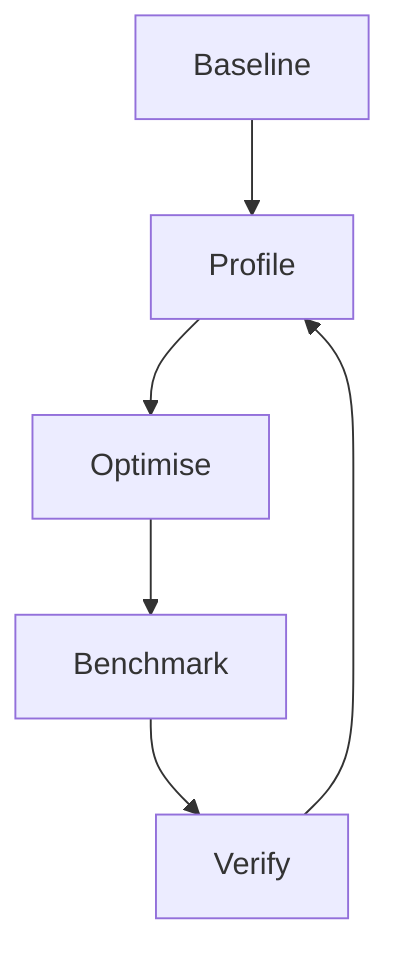
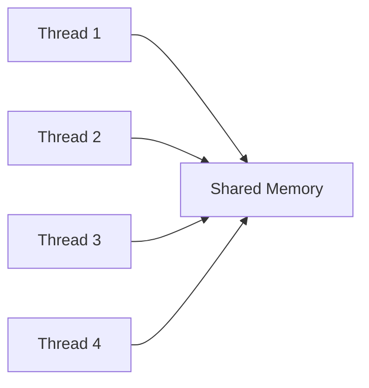
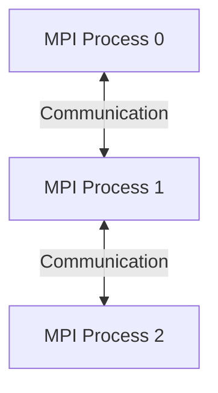

# HPC/AI Workshop 1: Introduction to HPC Performance Optimisation with Aspire2A

High Performance Computing (HPC) is about more than having access to thousands of CPU cores
it is about writing software that can efficiently utilise those resources.

By the end of this workshop you will have learned:

- Using the Aspire2A supercomputer.
- building scientific applications
- compiler optimisation
- performance profiling
- OpenMP parallelisation
- MPI execution
- performance analysis.

# Workshop Flow

| Stage | Goal                                    |
| ----- | --------------------------------------- |
| 1     | Build a working program                 |
| 2     | Measure baseline performance            |
| 3     | Profile the application                 |
| 4     | Optimise: Enable compiler optimisations |
| 5     | Optimize: Enable OpenMP                 |
| 6     | Optimise: Run with MPI                  |
| 7     | Independent optimisation exercises      |

# Setup: Accessing & Using Aspire2A

## Accessing Aspire 2A

To access Aspire2A, first register an NSCC user account, then connect to Aspire2A using SSH.

### Setup NSCC User Account

To access Aspire2A, follow these steps:

1. **Ensure you are on the NTU network (`NTUSecure`)**

   > Outside NTU? First connect to the NTU VPN using the [VPN](https://vpngate-student.ntu.edu.sg/global-protect/getsoftwarepage.esp), then connect to Aspire2A via the [NTU Jump Host](https://entuedu.sharepoint.com/teams/ntuhpcusersgroup2/SitePages/Using-NTU-JumpHost-to-NSCC-ASPIRE-2A.aspx).
   >
   > The detailed jump host setup is left as an exercise for the reader.

2. Go to the [NSCC User Portal](https://user.nscc.sg/saml/) and register for Aspire2A access.
3. Set a password by following the [NSCC User Enrollment Guide](https://help.nscc.sg/wp-content/uploads/2024/05/NSCC-UserEnrollmentGuide-v0.1.pdf).

   > **Optional:** Configure SSH key authentication for passwordless login.

---

## Connecting to Aspire2A via SSH

You can connect to Aspire2A using any SSH client:

- **Windows Terminal**
- **PowerShell**
- **Command Prompt**
- **WSL (Windows Subsystem for Linux)**
- **macOS Terminal**
- **Linux Terminal**

1. Connect to Aspire2A:

   ```sh
   ssh <USERNAME>@aspire2antu.nscc.sg
   ```

   Replace `<USERNAME>` with your Aspire2A username.

2. **Accept the host key** (first login only)

   If prompted:

   ```text
   Are you sure you want to continue connecting (yes/no/[fingerprint])?
   ```

   Type:

   ```text
   yes
   ```

3. Enter your password when prompted.

## LUHESH

In this workshop, we will build and optimise the **LULESH (Livermore Unstructured Lagrangian Explicit Shock Hydrodynamics)** application developed by Lawrence Livermore National Laboratory (LLNL) to simulate Hydrodynamics, how fluids move and interact with each other.

Clone an copy of the LULESH source code below:

```sh
git clone  https://github.com/llnl/LULESH.git
```

> Remember clone the source code outside of a compute node as it does not have `git` installed.

## Aspire2A Service Units

Aspire2A uses a project-based allocation system to manage access to compute resources. Every job submitted through PBS must specify a valid **project ID**, which determines where the resource usage is charged.

Aspire2A uses a **Service Unit (SU)** system to manage and account for compute resource usage. SU can be thought of as the **currency used to pay for access to computing resources**. Jobs consume SU based on the amount of CPU or GPU resources requested and the duration of the job.

- **CPU jobs:** 1 SU per CPU core hour.
- **GPU jobs:** 64 SU per GPU hour.

### Personal Project

New users receive a personal project allocation when their account is created. This allocation provides a fixed number of **Service Units (SU)** for learning, testing, and small-scale workloads.

Personal SU allocations are:

- **100,000 SU** for users from NUS, SUTD, NTU, and A\*STAR.
- **10,000 SU** for users from SIT, SMU, SUSS, NP, NYP, RP, SP, and TP.

Personal SU quotas are fixed, cannot be transferred, and cannot be topped up. After the personal allocation is exhausted, jobs must be submitted using an approved project allocation.

## Software Modules

Aspire2A uses an **environment module system** to manage compilers, MPI libraries, and scientific software. Before building an application, load the required software stack.

Common commands:

```bash
module purge          # Start with a clean environment
module avail          # List available modules
module list           # Show loaded modules
module load <module>  # Load a module
module unload <module>
```

Throughout this workshop, you will use modules to switch between different compiler and MPI environments. Start by using the GNU programming environment's modules:

```shell
module purge
module load PrgEnv-gnu
module list # list what modules are included
```

```
Currently Loaded Modulefiles:
  1) gcc/11.2.0               3) cray-dsmml/0.2.2         5) craype-network-ofi       7) cray-libsci/21.08.1.2    9) PrgEnv-gnu/8.3.3
  2) craype/2.7.15            4) libfabric/1.11.0.4.125   6) cray-mpich/8.1.15        8) cray-pals/1.1.6
```

## Compute Nodes



When you connect to Aspire2A via SSH, you are connected to a **login node**. Login nodes are intended for lightweight tasks such as editing files, compiling code, and submitting jobs.

To use Aspire2A's compute resources (CPUs and GPUs), you must request a **compute node** through the PBS scheduler. While small builds can be performed on the login node, computationally intensive builds and all applications runs should be performed on a compute node.

### PBS Scheduler

Request an interactive compute node with:

```sh
qsub -I -q normal -P personal -l select=1:ncpus=64 -l walltime=1:00:00
```

- `qsub` - Submit a job to PBS.
- `-I` - Start an interactive shell on the allocated compute node.
- `-q normal` - Submit to the `normal` queue.
- `-P personal` - Charge the job to your personal project.
- `-l select=1:ncpus=64` - Request 64 CPU cores on one compute node.
- `-l walltime=1:00:00` - Reserve the node for up to one hour.

> Once the job starts, your terminal is running on the allocated compute node and any commands you execute will use its resources.

> Note: If it takes more than 5 minutes to acquire a node, Aspire2A's job queues might be congested. We can verify this by running the `qstat -q` command.
>
> ```
> ...
> qdev              440gb    --    02:00:00  --      6    52   --   E R
> ...
> ```
>
> Woah, there are more than 52 jobs in front of you. It may be faster to acquire a GPU node instead, at the cost of a higher SU burn.
>
> ```sh
> qsub -I -q normal -P personal -l select=1:ncpus=64:ngpus=1 -l walltime=1:00:00
> ```

# Part 1: Build LULESH

Clone the repository

```bash
git clone https://github.com/LLNL/LULESH.git
cd LULESH
```

## Make

**Make** is a build automation tool that compiles source code according to rules defined in a **Makefile**.
It determines which files need to be rebuilt based on their dependencies and invokes the appropriate compiler commands automatically.

Take a peek at the Makefile to understand how LULESH is built:

```bash
less Makefile
```

Try to build LULESH using the provided Makefile.

```bash
make clean
make
```

```
Building lulesh.cc
mpig++ -DUSE_MPI=1 -c -g -O3 -fopenmp -I. -Wall -o lulesh.o  lulesh.cc
make: mpig++: Command not found
make: *** [Makefile:47: lulesh.o] Error 127
```

Bummer, the Makefile is trying to use `mpig++`. which is not available in the GNU programming environment.

We have two choices:

1. Load a prebuilt MPI implementation via `module load`.
2. Build a MPI implementation ourselfes

> In the interests of time, we will use a prebuilt implementation and building an MPI implementation by yourself is left as an exercise for the reader.

Discover what MPI implementations are available with `module avail`:

- `2>&1` redirects standard error to standard output, so that both are captured by the `grep` command.

```bash
module avail  2>&1 | grep mpi
```

```
cray-mpich/8.1.15(default)
cray-mpich-abi/8.1.15(default)
cray-mpich-abi-pre-intel-5.0/8.1.15(default)
cray-mpich-ucx/8.1.15(default)
bedtools/2.30.0                     namd/2.14_mpi_icc
berkeleygw/4.0-intel-mkl-cmpi       ncl/6.6.2
cuda/12.2.1                         nvhpc-byo-compiler/22.3
cuda/12.2.2                         nvhpc-nompi/22.3
gcc/10.3.0-nscc                     openfoam/2406-ompi505
gcc/11.4.0-nscc                     openmpi/4.1.2-hpe(default)
gcc/12.1.0-nscc                     openmpi/4.1.5-gcc11
gcc/12.2.0-nscc                     openmpi/4.1.6-gcc11
gcc/12.3.0-nscc                     openmpi/4.1.7-gcc11
gcc/14.2-nscc                       openmpi/4.1.7-icc24.2.1
gcc/15.2.0-nscc                     openmpi/5.0.5-gcc11
ghostscript/9.25                    openmpi/5.0.5-icc24.2.1
git/2.39.2                          openmpi/5.0.5-nv22.11
go/1.18.1                           openmpi/5.0.8-gcc11
go/1.21.1                           openmpi/5.0.8-gcc11-cu12
go/1.23.4                           openmpi/5.0.10-gcc11
go/1.24.4                           openmpi/5.0.10-gcc11-cu12
gromacs/2026.1-gnu-ompi             pytorch/1.11.0-py3-gpu
faocl/3.1.0-aocc3.2                  hdf5/1.12.1-parallel-icc22-ompi4
aocl/3.1.0-gcc11.1                  hdf5/1.12.1-parallel-icc23-cmpi
aocl/3.2.0-aocc3.2                  hdf5/1.12.1-parallel-icc24-ompi4
aocl/3.2.0-gcc11.2                  hdf5/1.12.2-parallel-icc22-cmpi
aocl/4.0.0-aocc4.0                  hdf5/2.0.0-parallel-gcc-cmpi
aocl/4.0.0-gcc11.2                  hdf5/2.0.0-parallel-icc24-ompi
fftw/3.3.10-gcc11-ompi4             openblas/0.3.23
fftw/3.3.10-icc22-cmpi              openjpeg/1.5.2
fftw/3.3.10-icc22-ompi4             openjpeg/2.4.0
gmp/6.2.1                           scalapack/2.2.0-icc22-cmpi-openblas
grib_api/1.25.0                     scalapack/2.2.0-icc22-ompi4-mkl22
gsl/2.7.1-gcc11                     scalapack/2.2.0-icc23-cmpi-mkl23
gsl/2.7.1-hpe                       scalapack/2.2.0-icc24-cmpi
hdf5/1.8.23-parallel-icc22-vmpi2    sparsehash/2.0.4-gcc11
hdf5/1.10.8-parallel-icc22-cmpi     szip/2.1.1
hdf5/1.12.1-parallel-icc22-cmpi
```

There are many `mpi` choices available. Lets try `openmpi/5.0.10-gcc11` and rebuild:

```bash
module load openmpi/5.0.10-gcc11
make
```

```
Building lulesh.cc
mpig++ -DUSE_MPI=1 -c -g -O3 -fopenmp -I. -Wall -o lulesh.o  lulesh.cc
make: mpig++: Command not found
make: *** [Makefile:47: lulesh.o] Error 127
```

Hmm no luck, lets take a look at the first few lines of the `Makefile` for clues

```make
#default build suggestion of MPI + OPENMP with gcc on Livermore machines you might have to change the compiler name

SHELL = /bin/sh
.SUFFIXES: .cc .o

LULESH_EXEC = lulesh2.0

MPI_INC = /opt/local/include/openmpi
MPI_LIB = /opt/local/lib

SERCXX = g++ -DUSE_MPI=0
MPICXX = mpig++ -DUSE_MPI=1
CXX = $(MPICXX)
```

We see that `SERCXX`, `MPICXX` are set to compiler commands `g++` and `mpig++`, lets check if we have them on our system:

```bash
g++
```

```
g++: fatal error: no input files
compilation terminated.
```

```bash
mpig++
```

```
bash: mpig++: command not found...
```

Weird, we have loaded `openmpi/5.0.10-gcc11` but is missing the compiler. Attempt to find the compiler using the shell's autocomplete:

```bash
mpi<Tab><Tab>
```

```
mpic++        mpicc         mpiCC         mpicxx        mpiexec       mpiexec.pals  mpif77        mpif90        mpifort       mpirun
```

Ah! The compiler is named differently, we correct this by applying a command line override to `MPICXX` when building with make.

```bash
make MPICXX="mpicxx -D USE_MPI=0 -D WITH_OPENMP=0" CXXFLAGS="-g -I." LDFLAGS="-g"
```

> Quotes `"` are necessary to ensure the entire quoted value is passed into `MPICXX` . For teaching purposes, we build without MPI & OpenMP and disable compiler optimisations.

```
Building lulesh.cc
mpicxx -D USE_MPI=0 -D WITH_OPENMP=0 -c -g -I. -o lulesh.o  lulesh.cc
Building lulesh-comm.cc
mpicxx -D USE_MPI=0 -D WITH_OPENMP=0 -c -g -I. -o lulesh-comm.o  lulesh-comm.cc
Building lulesh-viz.cc
mpicxx -D USE_MPI=0 -D WITH_OPENMP=0 -c -g -I. -o lulesh-viz.o  lulesh-viz.cc
Building lulesh-util.cc
mpicxx -D USE_MPI=0 -D WITH_OPENMP=0 -c -g -I. -o lulesh-util.o  lulesh-util.cc
Building lulesh-init.cc
mpicxx -D USE_MPI=0 -D WITH_OPENMP=0 -c -g -I. -o lulesh-init.o  lulesh-init.cc
Linking
mpicxx -D USE_MPI=0 -D WITH_OPENMP=0 lulesh.o lulesh-comm.o lulesh-viz.o lulesh-util.o lulesh-init.o -g -lm -o lulesh2.0
```

Finally, LULESH has been built.

# Part 2: Running LULESH

## Run Lulesh

Before attempting any optimisation, establish a unoptimised baseline to compare against. We measure the runtime of LULESH on problem size `-s` of 25.

```bash
cd $PBS_O_WORKDIR # change to the folder you ran qsub from.
module load
./lulesh2.0 -s 25 -p
```

```
Running problem size 25^3 per domain until completion
Num processors: 1
Total number of elements: 15625

To run other sizes, use -s <integer>.
To run a fixed number of iterations, use -i <integer>.
To run a more or less balanced region set, use -b <integer>.
To change the relative costs of regions, use -c <integer>.
To print out progress, use -p
To write an output file for VisIt, use -v
See help (-h) for more options

Run completed:
   Problem size        =  25
   MPI tasks           =  1
   Iteration count     =  752
   Final Origin Energy =  1.454737e+05
   Testing Plane 0 of Energy Array on rank 0:
        MaxAbsDiff   = 3.637979e-11
        TotalAbsDiff = 4.633302e-10
        MaxRelDiff   = 5.848682e-13

Elapsed time         =         65 (s)
Grind time (us/z/c)  =  5.5653944 (per dom)  ( 65.393384 overall)
FOM                  =  179.68179 (z/s)
```

- `Problem Size` The value passed to `-s`, which determines the dimensions of the simulation mesh. For example, `-s 25` creates a mesh of 253=15,62525^3 = 15,625253=15,625 elements. Use the **same problem size** throughout the optimisation process to ensure a fair comparison.
- `MaxAbsDiff` The maximum absolute difference between the computed solution and LULESH's reference solution. This is used to verify that the program still produces correct results after each optimisation, as some optimisations might appear to execute faster but produce numerically off results.
- `Elapsed Time` The total execution time reported by LULESH in seconds. We evaluate optimisations by their ability to **reduce** `Elapsed Time`.

# Part 3: Optimising LULESH

Instead of applying all optimsations all at once, we apply optimisations iteratively to observe their effect. Apply one optimisation at a time, measure its impact, and verify that the program still produces correct results.



The optimisation workflow consists of five steps:

1. **Baseline**: Record the initial runtime and correctness metrics.
2. **Profile**: Identify bottlenecks for optimisation.
3. **Optimise**: Apply a single optimisation.
4. **Benchmark**: Measure the new runtime, calculate the speedup, and repeat the process.
5. **Verify**: Confirm that the results remain correct (ie. `MaxAbsDiff`)

## Baseline

Each optimisation will be compared against a **recorded baseline** so that performance improvements can be quantified.

Record our initial results in a spreadsheet to establish a **baseline** performance to compare against.

| **Optimisation** | Problem Size | MaxAbsDiff   | Elapsed Time | **Speedup** |
| ---------------- | ------------ | ------------ | ------------ | ----------- |
| Baseline         | 25           | 3.637979e-11 | 65           | 1x          |

> We accept optimisations that produce solution with `MaxAbsDiff` within <= 1e-10 of the reference solution.

## Speedup

The **speedup** of an optimisation measures how much faster it runs compared to the baseline:

$$
\text{Speedup} = \frac{\text{Baseline Elapsed Time}}{\text{Optimised Elapsed Time}}
$$

For example, if the baseline runtime is **65 s**:

| Elapsed Time | Speedup |
| ------------ | ------- |
| 65 s         | 1.00×   |
| 32.5 s       | 2.00×   |
| 21.7 s       | 3.00×   |
| 13.0 s       | 5.00×   |

A larger speedup indicates a greater performance improvement. For example, a speedup of **2×** means the optimised program completes in half the time of the baseline, while a speedup of **5×** means it completes five times faster.

## Optimisation: Different Compilers

Different compilers can generate different machine code from the same source code. Compiler design, optimisation strategies, and hardware-specific features can affect the final performance of an application.

Repeat the same benchmark using different compiler environments:

Example:

- GCC
- Intel OneAPI

Build LULESH with a different compiler:

```bash
# load a different compiler environment
module purge
module load PrgEnv-intel/8.3.3  openmpi/5.0.5-icc24.2.1

# clean up the original build, or make won't rebuild
make clean
# rebuild
make MPICXX="mpicxx -D USE_MPI=0 -D WITH_OPENMP=0" CXXFLAGS="-g -I." LDFLAGS="-g"

# run in compute node
./lulesh2.0 -p -s 25
```

Record our optimised result and compare against our baseline performance:

| **Optimisation** | Problem Size | MaxAbsDiff   | Elapsed Time | **Speedup** |
| ---------------- | ------------ | ------------ | ------------ | ----------- |
| Baseline         | 25           | 3.637979e-11 | 65           | 1.00×       |
| Intel Compiler   | 25           | 2.728484e-11 | 47           | 1.38×       |

## Optimisation: Compiler Flags

Compiler flags control how the compiler transforms source code into an executable. Optimisation `-O1,-O2,-O3,-OFast` flags allow the compiler to apply optimisations without changing the original source code.

Without changing a single line of code, try different optimisation levels (eg. `-O3`):

```bash
# clean up the original build, or make won't rebuild
make clean
# rebuild
make MPICXX="mpicxx -D USE_MPI=0 -D WITH_OPENMP=0" CXXFLAGS="-g -I. -O3" LDFLAGS="-g -O3"
# run in compute node
./lulesh2.0 -p -s 25
```

Record our optimised result and compare against our baseline performance:

| **Optimisation** | Problem Size | MaxAbsDiff   | Elapsed Time | **Speedup** |
| ---------------- | ------------ | ------------ | ------------ | ----------- |
| Baseline         | 25           | 3.637979e-11 | 65           | 1x          |
| -O3              | 25           | 3.637979e-11 | 8.3          | 7.83×       |

## Optimisation: OpenMP Parallelisation

OpenMP provides **shared-memory parallelism**, where multiple threads execute on the same compute node and share memory.



Compile LULESH with OpenMP support:

```
make clean
make MPICXX="mpicxx -D USE_MPI=0 -D WITH_OPENMP=1" CXXFLAGS="-g -I. -O3" LDFLAGS="-g"
```

Run with different thread counts:

```
OMP_NUM_THREADS=1 ./lulesh2.0 -s 25
OMP_NUM_THREADS=8 ./lulesh2.0 -s 25
OMP_NUM_THREADS=16 ./lulesh2.0 -s 25
OMP_NUM_THREADS=32 ./lulesh2.0 -s 25
OMP_NUM_THREADS=64 ./lulesh2.0 -s 25
```

Record our optimised result and compare against our baseline performance:

### Optimisation: MPI and Hybrid Parallelisation

MPI enables parallel execution across multiple nodes by communicating between independent processes.



Compile LULESH with MPI support:

```bash
make clean
make MPICXX="mpicxx -D USE_MPI=1 -D WITH_OPENMP=0" CXXFLAGS="-g -I. -O3" LDFLAGS="-g -O3"
```

Run with different MPI process & counts:

```bash
mpirun -np 1 ./lulesh2.0 -s 25

mpirun -np 2 ./lulesh2.0 -s 25

mpirun -np 4 ./lulesh2.0 -s 25
```

Record our optimised result and compare against our baseline performance:

# Challenge Exercises (Student-led)

# Part 10 - Submit Through PBS

After experimenting on an interactive node, submit the benchmark as a PBS batch job.

Students modify

- walltime
- CPU count
- job name

Submit

```bash
qsub run.sh
```

Monitor

```bash
qstat
```

Read results

```bash
cat lulesh.o*
```

---

## Build LULESH with CMake

Compile LULESH **without any compiler optimisations** (`Debug` build).

```bash
mkdir -p build
cd build
cmake -DCMAKE_BUILD_TYPE=Debug ..
cmake --build .
```

Run the executable:

```bash
./lulesh2.0
```

Record the runtime.

| Configuration        | Runtime |
| -------------------- | ------- |
| Serial (Debug / -O0) |         |

This runtime serves as the baseline for later performance comparisons.

---

## Challenge 1

Can you find compiler flags that outperform `-O3`?

Hints

- architecture-specific optimisation
- vectorisation
- floating-point optimisation

---

## Challenge 2

Investigate OpenMP scheduling.

Try

```text
schedule(static)
schedule(dynamic)
schedule(guided)
```

Does runtime change?

---

## Challenge 3

Experiment with

```text
OMP_PROC_BIND

OMP_PLACES
```

Does thread affinity matter?

---

## Challenge 5

Profile the OpenMP version.

Has the hotspot changed?

---

## Challenge 6

Compare

- many MPI processes
- few MPI processes + many threads

Which performs better on Aspire2A?

---

# Final Performance Summary

Students should complete a results table throughout the workshop.

| Stage              | Runtime | Speedup |
| ------------------ | ------- | ------- |
| Serial (-O0)       |         | 1×      |
| Serial (-O3)       |         |         |
| Intel Compiler     |         |         |
| OpenMP (8 threads) |         |         |
| MPI (8 ranks)      |         |         |
| Hybrid (2×4)       |         |         |
